# Visibility Buffer / FrameGraph

A multi-stage GPU-driven renderer where a frame graph derives every barrier, 
layout transition, and queue-ownership transfer.

Making a particulary good renderer wasn't the intention here.
The example simply tries to cram a lot of features to flex the resource management.

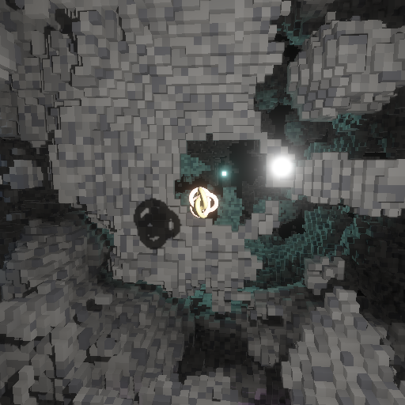

## Try it

```sh
stack run visibility-buffer
```

### Controls

Arrows orbit, `-`/`+` dolly, `0`–`6` switch beauty/debug channels,
`.` prints the camera, `g` dumps the live graph to `visibility-buffer-live.dot`
(render with `dot -Tsvg`) and `visibility-buffer-live.json` (load into the
[FrameGraph viewer](https://skaarj1989.github.io/FrameGraph/)).

CLI has more stuff to tweak, see `--help`.

## The scene

A blocky noise field with some carve-outs, and a smooth torus knot.
Everything is generated by compute into a shared SSBO.
A few shadow-casting point lights: 2 dynamic (the orbs) + 6 static (the glowstones).

## GPU-driven instanced drawing

Everything lives in shared SSBO tables: one vertex buffer, a mesh table (`{baseVertex, vertexCount}`),
and an object table (`{transform, emissive, meshId, materialId}`). A single raster pipeline
vertex-pulls `vertex[mesh.baseVertex + gl_VertexIndex]` and  places it with the object's transform.
The whole camera view is one `vkCmdDrawIndirect` over three draw commands, no vertex attributes to bind.

## The frame schedule

| Queue family | Pass | Work |
| --- | --- | --- |
| graphics | [`orbs.upload`](#update-dynamic-lights-and-their-meshes) | upload the moving lights' data |
| graphics | [`cull.reset`](#early-cull) | reset the GPU-written draw commands |
| graphics | [`cull.early`](#early-cull) | cull with last frame's knowledge; collect shadow casters |
| graphics | [`shadow.orbs`](#dynamic-shadows) | redraw the moving lights' shadow cubes |
| graphics | [`geometry.early`](#early-geometry) | draw the early list into visibility + depth |
| graphics | [`hiz.*`](#depth-pyramid) | build the depth pyramid, big levels |
| graphics | [`hiz.tail`](#depth-pyramid) | finish the small levels in one dispatch |
| graphics | [`cull.late`](#late-cull) | re-test the undrawn against the new pyramid |
| graphics | [`geometry.late`](#late-geometry) | draw the disoccluded remainder on top |
| graphics | [`ssao.normals`](#ssao) | rebuild normals + depth at half res |
| graphics | [`ssao`](#ssao) | gather ambient occlusion |
| graphics | [`ssao.blur.x` / `.y`](#ssao) | denoise it |
| **compute** | [`shade`](#shade) | resolve visibility into a lit HDR image |
| **compute** | [`bloom.down.*`](#bloom) | build the bloom pyramid |
| **compute** | [`luminance`](#metering) | measure the frame's brightness |
| host | [`host.meter`](#metering) | set the exposure from the measurement (only headless) |
| **compute** | [`lumProbe`](#metering) | snapshot the metered mip (only headless) |
| **compute** | [`bloom.up.*`](#bloom) | fold the pyramid back up, in place |
| **compute** | [`tonemap`](#tonemap-and-gamma) | apply exposure and the tone curve |
| **compute** | [`gamma`](#tonemap-and-gamma) | sRGB-encode, when the target needs it |
| graphics | [`blit`, `finalize swapchain`](#present) | copy out and hand off to present (only windowed) |

The compute rows ride the async compute family when the hardware has one,
and collapse onto graphics when it doesn't.

### Update dynamic lights and their meshes

Three `vkCmdUpdateBuffer` writes refresh the rows the orbs move: their light
positions, their shadow cube's view-projections, and their object-table transforms.
The glowstone prefix of each table was uploaded once at setup and never touched
again. The graph places the transfer barriers, including against the previous
frame's still-running readers of the same tables.

### Early cull

- `cull.reset` transfer-rewinds the draw commands the GPU writes each frame (the
camera cube draw, the late draw, the per-orb occluder draws).
- `cull.early` then runs one compute thread per cave cube:
  * bounding sphere vs. the frustum,
  * then the cube's visibility word (was it visible last frame?),
  * then — once the pyramid is primed — last frame's hi-Z (the two-phase scheme of [Haar2015]).

Survivors append their object id to the camera instance remap and bump the cube draw's `instanceCount`.
A stale visibility word costs some overdraw or defers a cube to the late phase, but does not produce "pops".

The same dispatch refills each orb's shadow occluder set using a sphere-vs-sphere reach test against the orb's
falloff window. The objects get appended to that orb's own draw command buffer.

### EVSM shadows

The glowstones EVSM cubes are baked once at setup and enter the graph as imported resources
owned by the graphics queue.

The orbs are moving, so their moment layers are re-rendered each time.
One multiview pass per orb draws all six cube faces at once (`gl_ViewIndex` picks the face).
Each layer contains four exponential-variance moments [Lauritzen2008] of the light-space distance.
Each orb draws its own occluder set prodcued by the reach test in `cull.early` and updated
in the same dispatch for the scene, so the shadow never lags the light.

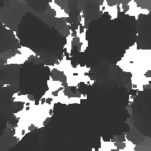

### Early geometry / Visibility buffer

The (culled) scene geometry is drawn in one `vkCmdDrawIndirect` over three buffers produced
 — cubes, knot, orb sphere — rasters the
early list into the visibility buffer and a reverse-Z depth target. The vertex
shader reads the object id through the instance remap, so cull compaction reorders
the draws without disturbing the ids the resolve will see.

Each fragment writes `(objectId + 1, triangleId)` into an `R32G32_UINT` target:

| `objectId` channel | `triangleId` channel | depth |
| --- | --- | --- |
| 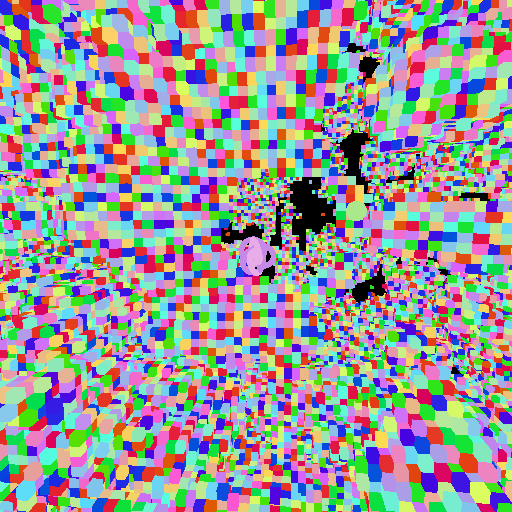 | 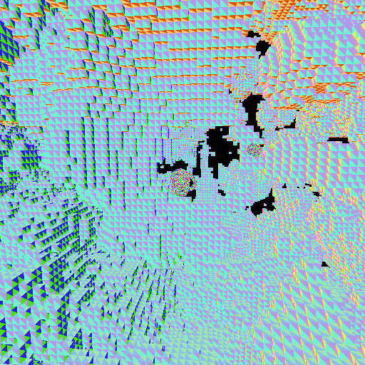 | 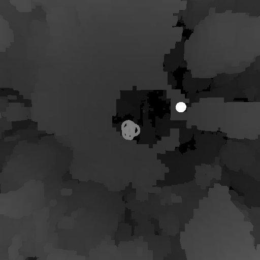 |

The actual material attributes will be reconstructed later ([Shade](#shade)) and
not stored to avoid the bandwidth cost of a full G-buffer [Burns2013].

### Depth pyramid

Technically, with the objects and triangles resolved for each pixel, the depth buffer is not needed anymore.
However, it is possible to reuse it to improve the culling even further.
The early culling is using the depth pyramid produced by this stage of the previous frame.

Using the reverse-Z depth not only brings more floating point accuracy on long distances,
but also naturally matches the data needed for the occlusion culling comparisons.
The minimum value is "farthest", so a a min-reduced pyramid conservatively bounds everything
rasterized beneath it.

Per [Turitzin2020], the pyramid is built by reducing the depth buffer and stored in the mip levels.
The largest levels are produced one by one (`hiz.0`, ...), until the remainder fits into a workgroup memory.
Then it dumped with a single dispatch (`hiz.tail`) to avoid extra pipeline drain waits from a trivial
amount of work.

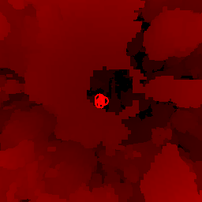 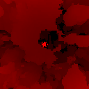 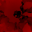 
   

### Late cull

To prevent visual popping, another cull/draw round is made against the newly
refreshed depth pyramid.

Previously drawn objects skip the test based on their visibility flag.
Objects that were hidden before are re-tested and may be appended to
the instance list used by `geometry.early`, increasing its counter.

The resulting extended list willl be reused as a conservative candidate list
in the next frame, paying some overdraw to avoid visual popping.

### Late geometry

The same raster body as `geometry.early`, loading the existing visibility and depth
instead of clearing, drawing the single late command over the top. The frame's
geometry is now complete.

### SSAO

`ssao.normals` runs the DAIS reconstruction at half resolution to get world normals
and an exact per-texel view depth (the min-reduced pyramid would pair a background
depth with a foreground normal at silhouettes). `ssao` gathers Alchemy-style
obscurance [McGuire2011AlchemyAO] over a spiral of taps into the depth pyramid, stepping up the mip ladder
as the taps widen. The two `ssao.blur` passes are one separable cross-bilateral
blur — depth- and normal-weighted, so the spiral noise goes away without obscurance
bleeding across silhouettes. The pyramid predates the late draws, so freshly
disoccluded geometry gets no ambient occlusion for one frame.

| World normals | Blurred AO factor |
| --- | --- |
| 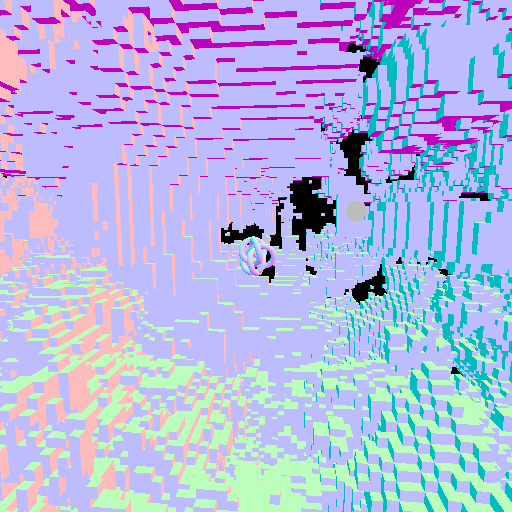 | 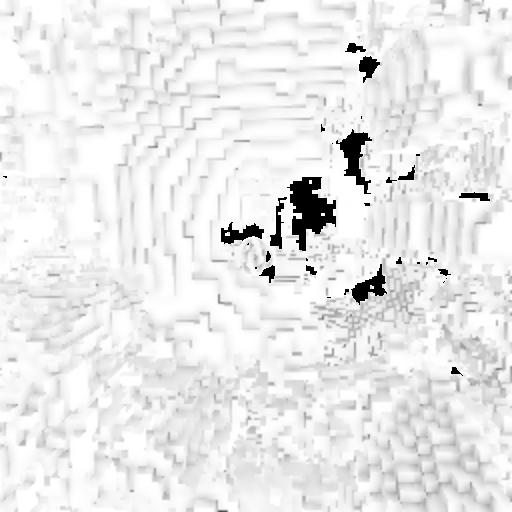 |

### Shade

One compute dispatch resolves the whole image: fetch the pixel's `(objectId, triangleId)`,
fetch the object's transform and mesh, fetch the triangle from the
shared vertex buffer, barycentric-interpolate world position and normal (DAIS —
deferred attribute interpolation, [Schied2015]). Emissive
objects output their stored radiance; everything else shades PBR-lite per light —
`N·L / dist²` through an EVSM soft-shadow lookup, plus a Blinn-Phong glint sharing
the same shadow. The SSAO factor attenuates only the ambient terms: direct light
casts real shadows.

A `debugMode` push replaces the output with a raw channel, which is how every
debug image on this page was captured.

| Albedo | Metalness | Roughness |
| --- | --- | -- |
| 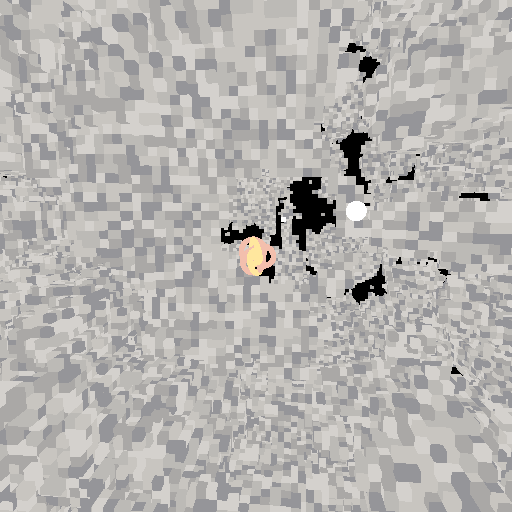 | 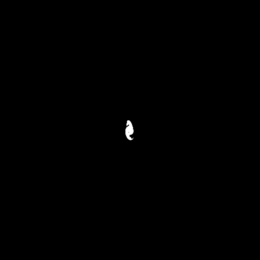 | 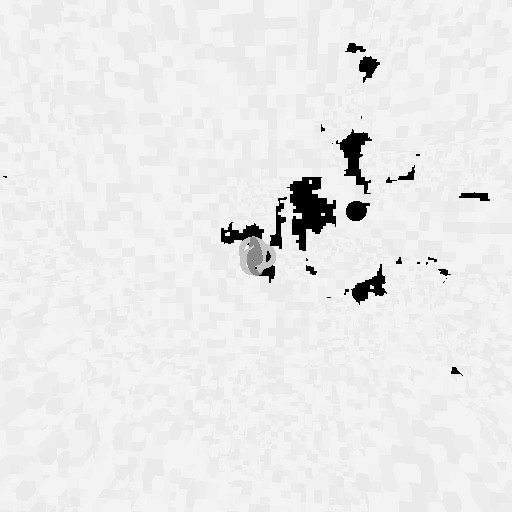 |

Resulting color:

| HDR, scaled to 0.125 white point |
| --- |
|  |

### Bloom

There is no brightness threshold, the blur favours bright pixels on its own.
The Call of Duty pyramid [Jimenez2014] [PBBloom2022] is performed on the HDR image directly.

- `bloom.down.*` progressively downsamples with a 13-tap weighted filter.
- `bloom.up.*` walks back up adding a 3×3 tent of the smaller mip *in place*.

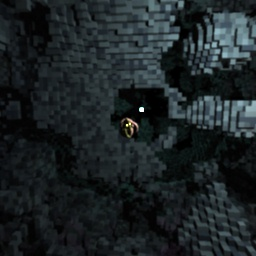 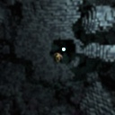 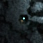
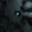  

... and back ...

    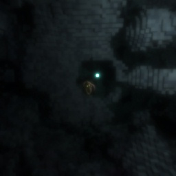 

The first downsample applies a softened [Karis2013] average to suppress extra-bright points and
spill some brightness into the global metering scope.

The frame graph emits the intra-image barriers using each mip level as a tracked subresource, .

### Metering

`luminance` pipeline reduces one workgroup-fitting mip pre-filtered mip level to produce a mean log-luminance.

- The windowed driver polls the value from a host-mapped memory each frame and adjusts scene's exposure value.
- The headless driver instead reads the EV directly and immediately uses it for tonemapping.
   The frame graphs schedules a device-host-device sandwich like any other pass.

| The metered bloom mip |
| --- |
| | 

### Tonemap and gamma

`tonemap` scales by the metered exposure and applies the "Gran Turismo"
curve [Uchimura2018] per channel. Emitters getting clipped desaturate toward white.

`gamma` is done in a separate pass so framegraph can prune it away if the target is an sRGB swapchain.
An UNORM swapchain or a PNG export needs it to match the brightness.

### Present

The drivers attach demand side to the frame graph constructed by the scenes.
`FG.compileWith` then prunes everything not transitively reachable from the
present/export as a demand goal.
Frame graph configuration can also be built statically or adjusted on the fly.
The graph compiler will optimize it to shed the work that won't be used.

## What's in the graph

The [fragr](https://hackage.haskell.org/package/fragr) package implements the [ODonnell2017] model.:

- Create or import resources, get handles.
- Register reads and writes inside the passes.
- Every write advances the handle by renaming (can't use a stale version).

From those declarations `fragr` derives:

- Barriers, including the intra-image (like bloom's in-place upsample add and the
  SSAO blur ping-pong) and the write-after-read against the previous frame's
  still-running consumers.
- Queue scheduling: shade and the post chain run on an async compute queue (when
  the hardware has one). The compiled schedule adds semaphores and
   `EXCLUSIVE`-ownership release/acquire pairs (the baked shadow slices, the swapchain hand-off) as needed.
  Without an active async family the same graph is squished to one submit.
- Demand culling: the code can declare the whole thing without having to consider
   how it would be used. Only the actually needed parts would be executed.
   Present a debug channel and the entire bloom/tonemap/luminance chain vanishes.
   Present to an sRGB swapchain and the gamma pass goes away.

## The resource chart export

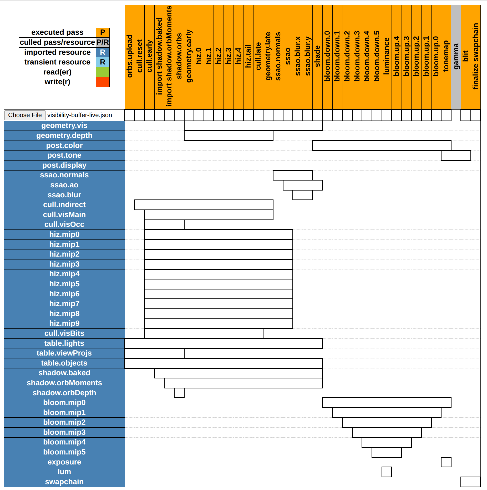

The original repository provides a neat [FrameGraph viewer](https://skaarj1989.github.io/FrameGraph/).
- Columns are passes in scheduled order.
- Rows are resources
- Each bar spans a resource's lifetime from first write to last read:
  * The bloom staircase narrowing down and widening back
  * The hi-Z mips all alive from `cull.early` (last frame's pyramid) to `cull.late` (this frame's),
  * The one-pass life of `shadow.orbDepth`
  * The grey `gamma` column sitting culled between `tonemap` and `blit` (the dump machine's swapchain was sRGB).

## GraphViz export

Orange passes execute, grey ones are culled, `*` marks externally-observed passes.

It is as long as a frame is deep, click to open:

<details>
<summary>Frame graph, dot render</summary>

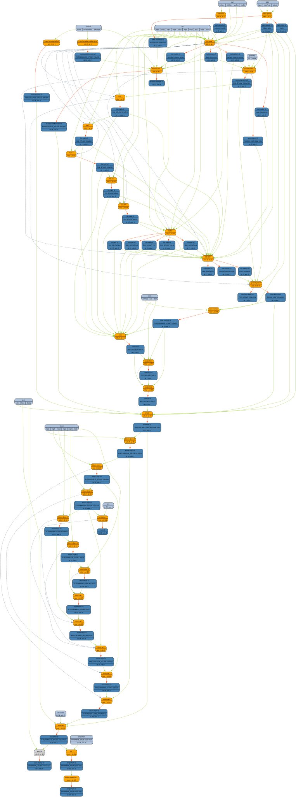

</details>

## Bibliography

- [Haar2015]: GPU-driven rendering pipelines (SIGGRAPH 2015)
- [Lauritzen2008]: Layered variance shadow maps (GI 2008)
- [Burns2013]: The visibility buffer: a cache-friendly approach to deferred shading (JCGT 2013)
- [Turitzin2020]: Hierarchical depth buffers
- [McGuire2011AlchemyAO]: The Alchemy screen-space ambient obscurance algorithm (HPG 2011)
- [Schied2015]: Deferred attribute interpolation for memory-efficient deferred shading (HPG 2015)
- [Jimenez2014]: Next generation post processing in Call of Duty: Advanced Warfare (SIGGRAPH 2014)
- [PBBloom2022]: Physically based bloom (LearnOpenGL guest article)
- [Karis2013]: Tone mapping (Graphic Rants)
- [Uchimura2018]: Practical HDR and wide color techniques in Gran Turismo SPORT
- [ODonnell2017]: FrameGraph: extensible rendering architecture in Frostbite (GDC 2017)

The graph-engine reading list lives in the
[fragr references](https://gitlab.com/dpwiz/fragr#references).

[Haar2015]: https://advances.realtimerendering.com/s2015/aaltonenhaar_siggraph2015_combined_final_footer_220dpi.pdf
[Lauritzen2008]: https://graphicsinterface.org/proceedings/gi2008/gi2008-18/
[Burns2013]: https://jcgt.org/published/0002/02/04/
[Turitzin2020]: https://miketuritzin.com/post/hierarchical-depth-buffers/
[McGuire2011AlchemyAO]: https://casual-effects.com/research/McGuire2011AlchemyAO/index.html
[Schied2015]: https://cg.ivd.kit.edu/publications/2015/dais/DAIS.pdf
[Jimenez2014]: https://www.iryoku.com/next-generation-post-processing-in-call-of-duty-advanced-warfare/
[PBBloom2022]: https://learnopengl.com/Guest-Articles/2022/Phys.-Based-Bloom
[Karis2013]: https://graphicrants.blogspot.com/2013/12/tone-mapping.html
[Uchimura2018]: https://cdn2.gran-turismo.com/data/www/pdi_publications/PracticalHDRandWCGinGTS_20181222.pdf
[ODonnell2017]: https://www.gdcvault.com/play/1024612/FrameGraph-Extensible-Rendering-Architecture-in
